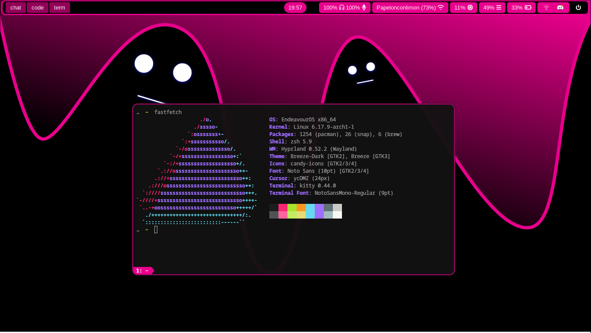

# My Configuration



## 💻 Machine
**Software** 
| Program    | Name                                      |
| ---------- | ----------------------------------------- |
| OS         | [EndeavourOS](https://endeavouros.com)    |
| Compositor | [Hyprland](https://hypr.land)             |
| Shell      | zsh                                       | 
| Terminal   | [Kitty](https://sw.kovidgoyal.net/kitty/) |
| Browser    | [Vivaldi](https://vivaldi.com/es/)        |
| IDE's      | VS Code, [Neovim](https://astronvim.com)  |
| File Manager | [Superfile](https://superfile.dev/overview/) |

## 🗒️ Requirements
- [Waybar](https://github.com/Alexays/Waybar?tab=readme-ov-file)
- [Wofi](https://github.com/SimplyCEO/wofi)
- [Hyprpaper](https://wiki.hypr.land/Hypr-Ecosystem/hyprpaper/)
- [Mako](https://github.com/emersion/mako)
- [network-manager-applet](https://man.archlinux.org/man/nm-applet.1.en)
- [PulvaControl](https://freedesktop.org/software/pulseaudio/pavucontrol/)
- [Gpicview](https://lxde.sourceforge.net/gpicview/)
 ### Others...
 ```bash
sudo pacman -S grim slurp wl-clipboard
```
