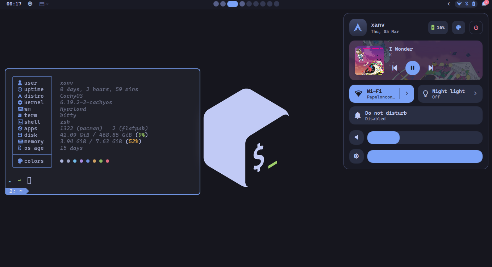

# The Rice ✨

Customizing [lyne-dots](https://github.com/caioax/lyne-dots) with my own settings.

| Program 💻   | Name 🖋              |
| ------------ | -------------------- |
| OS           | CachyOS              |
| Compositor   | Hyprland             |
| Components   | Quickshell           |
| Shell        | ZSH                  |
| Terminal     | Kitty                |
| Browser      | Zed Browser, Vivaldi |
| IDE          | AstroNvim            |
| File Manager | Dolphin, Superfile   |

## 📌 Extras
- [LSD](https://github.com/lsd-rs/lsd): Shell formatter.
- [Glow](https://github.com/charmbracelet/glow): Render markdown on the CLI.
- [Lazygit](https://github.com/jesseduffield/lazygit): Interface for Git within the terminal.
- [Newsboat](https://github.com/newsboat/newsboat): RSS feed reader for the terminal.
